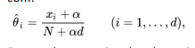

## Objetivo:   
Implementar o algoritmo Naive Bayes para tipos nominais em Python (Python 3) e testar
no ambiente scikit-learn.
## Descrição:  
Pretende-se a implementação de uma classe que permita a utilização do algoritmo Naive
Bayes com dados do tipo nominal, no ambiente do scikit-learn, com um estimador suavizado
(smooth estimator), e avaliação do classificador através da exatidão e precisão.
## Implementação:   
a classe a implementar -- **NaiveBayesUevora** -- deverá:
- na inicialização do objeto deve permitir a escolha de um estimador suavizado de acordo
com:  

Em geral este estimador denomina-se “Lindstone smoothing”; no caso particular de 𝛼=1
teremos o estimador de Laplace; com 𝛼=0 teremos o estimador usual. Este parâmetro
deverá ser designado alpha do tipo float. O valor de alpha por omissão deverá ser 𝛼=0
assumindo deste modo um estimador usual.
- A classe deverá aceitar dados nominais na forma de strings
- A classe deverá ter um método fit(x,y) para gerar um classificador a partir dum conjunto de
treino com etiquetas.
- A classe deverá ter um método predict(x) para, com base no classificador previamente
definido, gerar predições em função dum conjunto de dados de teste. O Método deve
devolver uma variável compatível com um array, com dimensões compatíveis com a
dimensão dos dados de teste usados.
- A classe deverá ter um método accuracy_score(x,y) para calcular a exatidão (accuracy) dum
classificador, devolvendo um tipo float, dado um conjunto de teste.
- A classe deverá ter um método precision_score(x,y) para calcular a precisão (precision) dum
classificador, devolvendo um tipo float, dado um conjunto de teste. O valor da precisão
deverá ser a média aritmética da precisão de cada classe, ou seja a precisão considerando
cada classe como a classe positiva sendo todas as restantes a classe negativa (caso os
Verdadeiros Positivos mais Falsos Positivos sejam zero, assuma que a precisão será zero).
Note que poderão existir nos dados de teste valores dos atributos e classe que não ocorrem nos
dados de treino. Considere esta situação, proponha uma solução, e implemente-a.

## Dados  

Serão disponibilizados no moodle vários conjuntos de ficheiros/dados para testar o trabalho

### Nota : 15 
[codigo](https://github.com/GBarradas/AA_Work_1.git)
